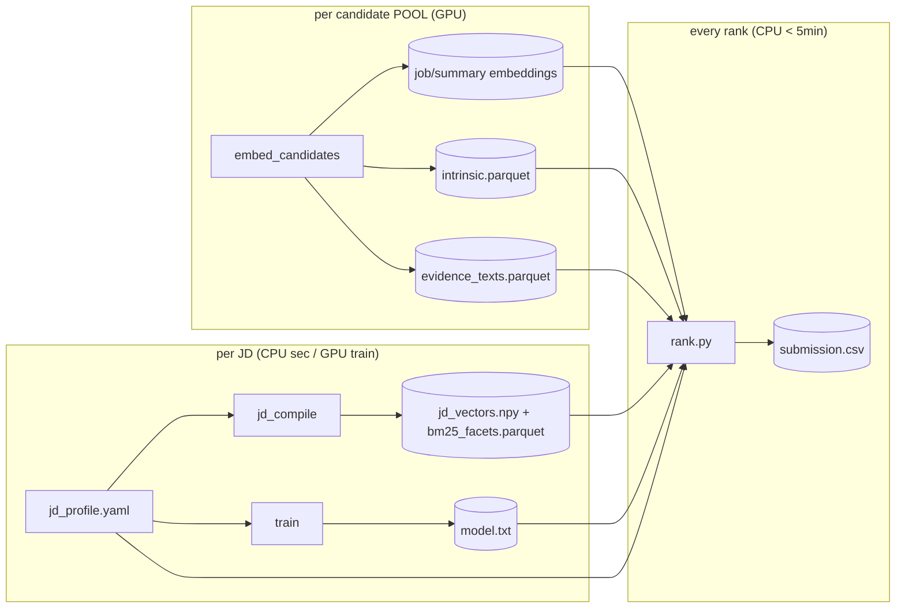

# v7 — JD-seam architecture (the "any JD" productization)

v7 backports v6's separation-of-concerns into the v5 submission shape
(CPU-only constrained rank step over precomputed artifacts) and **generalizes
it so a different JD is a config edit, not a code edit.**

The four deepening moves (candidates 1–4 from the architecture review):

1. **The JD seam** — all JD knowledge in [`jd/jd_profile.yaml`](jd/jd_profile.yaml),
   schema-validated; mechanism in [`jd/method_config.yaml`](jd/method_config.yaml).
2. **One rules engine** — the deterministic composite + gates, implemented
   once in `redrob_ranker/rules.py` (v5 had it copied in three files).
3. **An explicit precompute↔rank lifecycle** — three cadences, one orchestrator.
4. **A typed intrinsic-facts seam** — JD-independent candidate facts behind one
   schema, so feature code never re-parses raw profile JSON ad hoc.

## The three cadences (lifecycle seam — candidate 3)

What you re-run is keyed to *what changed*, not to filenames:

| Changed…            | Re-run                                   | Cost / hardware        |
|---------------------|------------------------------------------|------------------------|
| Candidate pool      | `embed_candidates` → embeddings + `intrinsic.parquet` + `evidence_texts.parquet` | minutes, **GPU** |
| Job description     | edit `jd_profile.yaml` → `jd_compile` (→ `jd_vectors.npy`); optionally `train` | seconds (compile) / minutes GPU (train) |
| Nothing (just rank) | `rank.py` — the constrained step         | **< 5 min, CPU-only**  |

The candidate-side artifacts carry **no JD knowledge**, so a JD change never
touches them. `rank.py` imports no torch/sentence-transformers and reaches no
GPU by construction.



## Module map & pinned interfaces (code against THESE)

> Implementations live in `redrob_ranker/`. The signatures below are the
> contract — sub-tasks implement to them so the pieces compose. `Profile` and
> `Method` are the parsed seams; `features` is a `pandas.DataFrame` indexed by
> `candidate_id`.

### `redrob_ranker/profile.py` — the seam adapter (candidate 1)
```python
@dataclass(frozen=True)
class Signal:      id: str; label: str; query: str; evidence_regex: str | None; dense_weight: float
@dataclass(frozen=True)
class Profile:     # parsed + validated jd_profile.yaml
    role: RoleSpec; locations: LocSpec; signals: list[Signal]
    dense_extras: dict; cross_encoder_query: str; domain: DomainSpec
    relevant_skill_regex: str; red_flags: dict[str, bool]
    # convenience:
    def signal_ids(self) -> list[str]: ...
    def evidence_signals(self) -> list[Signal]: ...   # those with evidence_regex
@dataclass(frozen=True)
class Method:      # parsed method_config.yaml (recency, fit_weights, damps,
                   # integrity, availability, notice_tiers, lexicons, ... )

def load(jd_path="jd/jd_profile.yaml", method_path="jd/method_config.yaml") -> tuple[Profile, Method]:
    """Load + JSON-Schema-validate the JD seam; raise ValueError with a precise
    message on any missing/mistyped field. Compiles every regex once."""
# CLI: `python -m redrob_ranker.profile --check jd/jd_profile.yaml`
```

### `redrob_ranker/rules.py` — the single deterministic engine (candidate 2)
Consolidates the composite/gates that v5 duplicated in
`build_rule_features.py:201-223`, `build_final_features.py:91-105`, and
`rank.py:142-176`. Pure (no I/O), fully vectorized over the feature frame.
```python
@dataclass(frozen=True)
class RuleResult:
    fit: np.ndarray            # pre-gate composite
    integrity: np.ndarray; availability: np.ndarray; notice_pen: np.ndarray
    loc2: np.ndarray
    final_rules: np.ndarray    # mm(fit) * integrity * availability * notice_pen

def compute_rules(features: pd.DataFrame, profile: Profile, method: Method) -> RuleResult: ...
```
Both the precompute label step **and** `rank.py` call this — there is exactly
one place the formula lives. It is the test surface (see `tests/test_rules.py`).

### `redrob_ranker/intrinsic.py` — JD-independent candidate facts (candidate 4)
The typed seam between raw `candidates.jsonl` and everything downstream. Owns
all knowledge of the 23 `redrob_signals` + `profile` JSON shape; nothing else
re-parses raw candidate JSON.
```python
INTRINSIC_COLUMNS: list[str]   # documented schema of intrinsic.parquet
def extract_intrinsic(records: Iterable[dict]) -> pd.DataFrame: ...   # JD-independent
```

### `redrob_ranker/features.py` — generic, signal-driven features
Iterates `profile.signals` (no hardcoded facet names): dense sims vs
`jd_vectors`, recency pooling, evidence regexes, domain ratio, assessments, and
the precomputed `<id>__bm25` lexical channel (loaded from `bm25_facets.parquet`).
Produces the feature frame consumed by `rules.compute_rules` and the student.

### `jd_compile.py` / `rank.py` / `embed_candidates.py` / `train.py`
Thin orchestrators over the modules above. `jd_compile.py` embeds the signal
queries (`jd_vectors.npy`) and also runs the per-JD BM25 pass over the evidence
docs (`bm25_facets.parquet`, via `redrob_ranker.bm25`) — matching root `rank.py`'s
lexical channel while keeping rank_bm25 out of the rank path. **`rank.py` already exists at the
repo root and is uncommitted** — the v7 `rank.py` is adapted from that current
working-tree file (telemetry, coverage-check, top-k, reasoning, streaming all
preserved); the only change is sourcing constants from `Profile`/`Method` and
calling `rules.compute_rules` instead of inlining the composite.

## Non-destructive

This whole tree lives under `versions/v7-jd-seam/` (gitignored, like all
`versions/`). It does not touch the committed v5 repo or the uncommitted root
`rank.py`. Promote into the submission via the usual replay process when ready.
