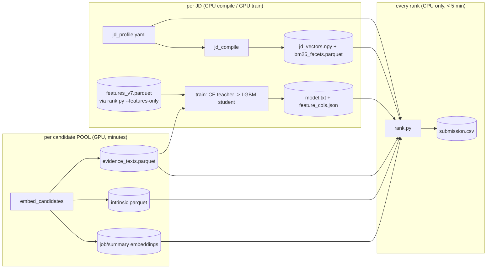

# RedRob Candidate Ranker — Intelligent Candidate Discovery & Ranking (Team: **RJ_In**)

Ranks the **top-100** best-fit candidates from a 100,000-candidate pool
(`candidates.jsonl`) against the **"Senior AI Engineer — Founding Team"** job
description, and writes a spec-compliant `submission.csv`
(`candidate_id, rank, score, reasoning`) with a 1–2 sentence auditable reason per
candidate. The constrained ranking step runs **CPU-only, offline, in ~39 seconds**
against the full pool — well inside the 5-minute / 16 GB budget.

> **Design in one line:** retargeting to a *new* JD is a **config edit, not a code
> edit.** All per-JD knowledge lives in [`jd/jd_profile.yaml`](jd/jd_profile.yaml);
> the JD-stable scoring mechanism (every numeric constant) lives in
> [`jd/method_config.yaml`](jd/method_config.yaml); the pure core
> ([`redrob_ranker/`](redrob_ranker)) reads those two seams. See
> [`ARCHITECTURE.md`](ARCHITECTURE.md) and [`jd/RETARGETING.md`](jd/RETARGETING.md).

---

## 1. Submission compliance — at a glance

Everything the spec ([`submission_spec.docx`](submission_spec.docx)) checks, and how
this submission meets it. **Measured, not estimated** (see §4).

| Spec requirement | Limit / rule | This submission |
|---|---|---|
| **Output file** | a **`.csv`** named for the participant ID (`.xlsx` / `.json` are **auto-rejected**) | `submission.csv` → rename to `<participantID>.csv` for upload ✓ |
| **Columns (in order)** | `candidate_id, rank, score, reasoning`, UTF-8 | exact, UTF-8 ✓ |
| **Rows** | exactly **100** data rows; ranks 1–100 each once; each `candidate_id` once | 100 rows, unique ranks 1–100, unique ids ✓ |
| **Score** | non-increasing as rank increases; ties broken deterministically | monotonic; ties → evidence-coverage then `candidate_id` ✓ |
| **Runtime** | ≤ 5 min wall-clock | **38.8 s** (12.9% of budget) ✓ |
| **Memory** | ≤ 16 GB RAM | **0.31 GB** (2%) ✓ |
| **Compute** | CPU only — **no GPU** | torch not installed in the rank venv → GPU unreachable ✓ |
| **Network** | off — no hosted-LLM calls | offline by construction (no `import torch`, no network) ✓ |
| **Disk** | ≤ 5 GB intermediate state | 627 MB artifacts read ✓ |
| **Honeypots** | rate **> 10% in top-100 = disqualified** (~80 tier-0 traps) | **0 known-impossible profiles in top-100** ✓ |
| **3 deliverables** | (1) CSV (2) portal metadata (3) code repo + (4) working sandbox link | all present (see §10, [`submission_metadata.yaml`](submission_metadata.yaml)) ✓ |
| **Reproduce command** | one command produces the CSV from the candidates file | `python rank.py --candidates ./candidates.jsonl --out ./submission.csv` (§2) ✓ |
| **Submission cap** | at most **3** submissions; final = last valid | noted |

**How you're scored** (computed once on hidden ground truth, after close):
`composite = 0.50·NDCG@10 + 0.30·NDCG@50 + 0.15·MAP + 0.05·P@10` — the **top 10
carry 55%** of the score; tiebreak P@5 → P@10 → earlier timestamp.

**Five evaluation stages:** (1) format validation → (2) automated scoring → (3) **code
reproduction + honeypot check** (CPU/5 min/16 GB sandbox) → (4) reasoning review (10
sampled rows checked for specific facts, JD connection, honest concerns, no
hallucination, variation, rank-consistency) → (5) 30-min defend-your-architecture
interview. The design below is built to pass **all five**, not just the metric.

---

## 2. The single reproduce command (Stage 3)

The constrained step that produces the CSV from the candidates file:

```bash
python rank.py --candidates ./candidates.jsonl --out ./submission.csv
```

CPU-only, no network, no GPU. **It reads the _precomputed artifacts_** in
`artifacts_v7/` and never imports torch (so a GPU is unreachable by
construction). Validate the output shape:

```bash
python validate_submission.py --submission ./submission.csv
```

### Setup (rank step)

```bash
python -m venv .venv && . .venv/bin/activate      # Windows: .venv\Scripts\activate
pip install -r requirements-rank.txt              # numpy/pandas/pyarrow/lightgbm/pyyaml — no torch
```

---

## 3. Pre-computation (offline, GPU optional, unbudgeted)

Per the spec, pre-computation may exceed the 5-minute window; only the rank step
above is budgeted. **This repo ships every artifact the rank step needs except
the two large embedding matrices** (`job_embeddings.npy` 440 MB,
`summary_embeddings.npy` 147 MB — above GitHub's file limit). Regenerate them
(and refresh all pool artifacts) with the precompute pipeline before ranking
from a fresh clone:

```bash
pip install -r requirements-precompute.txt        # adds torch / sentence-transformers / transformers
python embed_candidates.py --candidates ./candidates.jsonl   # -> embeddings, offsets, evidence, intrinsic
python jd_compile.py                                         # -> jd_vectors, bm25_facets (JD seam)
python rank.py --candidates ./candidates.jsonl --features-only   # -> features_v7.parquet (for training)
python train.py                                             # cross-encoder teacher -> LightGBM student
```

| Step | Cadence | Hardware |
|---|---|---|
| `embed_candidates.py` | per candidate **pool** | GPU (CPU works), minutes |
| `jd_compile.py` | per **JD** | CPU, seconds |
| `rank.py --features-only` | per JD (training input) | CPU |
| `train.py` | per JD (optional) | GPU, minutes |
| **`rank.py --out …`** | **every rank — the judged step** | **CPU only, < 5 min** |

A reproducible containerized path for all of the above is in
[`DOCKER_RUNBOOK.md`](DOCKER_RUNBOOK.md) (one `Dockerfile`, modes
`RANK` / `PRECOMPUTE` / `SERVE` via `--build-arg ENV_MODE`).

---

## 4. Compute budget & telemetry (measured)

**Constrained rank step** — Docker, `--network none --memory 16g --cpus 8`, the
full 100K pool (`rank.docker.log`):

| Metric | Measured | Limit | Used |
|---|---|---|---|
| Wall clock | **38.8 s** | 300 s | **12.9 %** |
| Peak RAM | **0.31 GB** | 16 GB | **2 %** |
| Compute | CPU only (torch not installed) | CPU only | ✓ |
| Network | off | off | ✓ |
| Artifacts read | 627 MB | 5 GB disk | ✓ |

Stage breakdown: `build_features` 38.3 s (parallel across 12 workers) dominates;
`compute_rules` 0.05 s, `lgbm_predict_blend` 0.35 s, `argpartition_topk` 0.01 s,
`reasoning_write_csv` 0.10 s. The feature build shards candidates across
processes (`RANK_WORKERS`, default `os.cpu_count()`); output is bitwise-identical
to the serial build. `validate_submission.py` reports **PASS on all 11 checks**
(exactly 100 rows, ranks 1..100 unique, monotonic scores, no empty reasoning, …).

**Pre-compute** — GPU (`device=cuda:0`), offline (`precompute.log`):
`embed_candidates` 686 s (100K candidates → 300,171 chunks), feature pass 98.5 s,
`train` 480 s (cross-encoder teacher 428 s + LightGBM student 50 s) ≈ **21 min**.

**Model quality** — held-out split, student vs. cross-encoder teacher
(`artifacts_v7/train_eval.json`): NDCG@10 **0.447**, NDCG@50 **0.703**, Spearman
**0.740** (best iteration 16). These measure the student's fidelity to the
teacher used for distillation, not the hidden ground truth.

---

## 5. Architecture

Everything expensive happens **once, offline**. The judged step only builds cheap
features, predicts, gates, and writes — at three distinct cadences:



**Why the skills array is never embedded.** The skills tags are the documented
stuffing channel (an HR Manager carrying Kubernetes/Docker/ETL). All text evidence
comes from `headline + summary + career descriptions`; tags only count when
corroborated by narrative text or proctored assessment scores (see §6).

**Ragged profiles → fixed-width features (scores, not raw vectors).** A candidate has
1–9 jobs; the model needs one row. We **never feed raw 384-dim vectors to the model** —
each job chunk's embedding is collapsed to a cosine *score* against each of the 6 JD
facet queries ("how relevant is this job to requirement *f*"), then pooled along the
job axis (recency-weighted mean, peak, most-recent, hit-count) plus the summary
chunk's score. 6 facets × poolings + 6 BM25 + structured/evidence/signal columns = the
same fixed feature width for everyone. Cosine-to-query extracts exactly the one
quantity per chunk the ranking needs — interpretable and tree-friendly.

---

## 6. Scoring methodology & rationale

The score is a **deterministic, auditable composite** (every constant lives in
[`jd/method_config.yaml`](jd/method_config.yaml) / [`jd/jd_profile.yaml`](jd/jd_profile.yaml)),
blended with a distilled LightGBM student. The design answers the JD's actual ask —
*has this person **shipped** retrieval/ranking, hands-on, at a product company* —
and is built to resist the dataset's keyword-stuffers and honeypots.

**The formula (per candidate).**

```
dense_fit = 0.28·ranking + 0.22·retrieval + 0.12·vectordb + 0.10·evaluation
          + 0.10·applied_ml + 0.08·yoe_fit + 0.10·domain_nlp_ratio   (recency-weighted facet cosines)
lex_fit   = mean(per-facet BM25)                                     (exact terms embeddings smear: NDCG, Qdrant…)
fit       = 0.38·dense_fit + 0.09·lex_fit + 0.08·depth_bonus         (ownership/scale depth)

fit ×= (0.15 + 0.85·evidence_coverage)          # (1) evidence GATE — no shipped evidence really costs
fit ×= (0.50 + 0.50·skill_corroboration)        # (2) keyword-stuffer DISCOUNT (only if AI skills are claimed)
fit ×= (1 + 0.25·assess_strength·min(1, cov/0.25))  # (3) assessment BONUS — upside-only, evidence-gated
fit ×= recency_ladder(months_since_IC_role)     # (4) 0.35 / 0.70 / 0.90 — "this role writes code"
fit ×= (0.60 + 0.40·yoe_fit)                     # (5) experience band (Gaussian around the JD's 5–9 yrs)
fit ×= cv_primary(0.60) · hopper(0.55) · consulting(≤0.30) · location(0.55+0.45·loc2)   # red-flag damps

final = minmax( 0.8·minmax(fit) + 0.2·minmax(student) ) · integrity · availability · notice
```

(`student` = LightGBM LambdaMART distilled from a `bge-reranker-v2-m3` cross-encoder
teacher; α=0.2, so the deterministic rules dominate 80/20.)

**Why six facet queries, not one JD embedding.** A single JD vector is the *average*
of all requirements, so a candidate who deeply matches one must-have looks identical
to one who weakly matches everything. The JD's own rubric is a checklist (production
retrieval; vector DB; shipped ranking at scale; evaluation; applied-ML at a product
company; LLM fine-tuning), so each must-have is its own short query. This buys
**discrimination** (per-requirement signal), **interpretability** ("strongest in
retrieval, weakest in evaluation" feeds both features and the reasoning string), and a
**distribution match** (bi-encoders are trained on short query → passage, not
document → document).

**Three principles behind the gates:**

1. **Applied experience is the ground truth, not skill tags.** Relevance is earned in
   the **career history**: each must-have signal is matched by regex over job
   descriptions, weighted by **ownership** (led/owned/designed ×1.0 vs participation
   ×0.7), **context** (the "internal dashboard/KB" template trap ×0.4), and **recency**
   (≈30-month half-life), then max-pooled across roles. *Summaries are excluded*
   (self-promotion isn't evidence). Each past role is scored as **one whole chunk**, so
   a "ranking" mention earns credit only with its surrounding ownership/scale context —
   defeating decontextualized keyword-stuffing.

2. **Self-reported skills can't buy rank (anti-keyword-stuffer).** A candidate's
   `skills` array — proficiency, `duration_months`, endorsements — **never adds
   positive score on its own.** Claimed AI skills only count when **corroborated by the
   career text** (gate (2): an uncorroborated stuffer is damped toward ×0.5, never
   lifted above 1.0). The array's *internal impossibilities* (durations exceeding the
   career, etc.) feed only the **soft** integrity ladder — in this synthetic pool those
   values are pervasive noise, so we damp them (×0.85–0.97), we do not trust them as
   ground truth or hard-gate on them.

3. **`skill_assessment_scores` is the one trusted out-of-experience skill signal.** The
   platform's proctored assessments are the single skill channel a stuffer cannot fake,
   so they're the *only* skill data that can lift a score — and even then conservatively:
   mean of the top-3 JD-relevant scores mapped `(s−40)/50` (a 50 isn't validation; a 90
   is), **confidence-discounted by test count** `×n/(n+0.5)`, and **evidence-gated**
   (`min(1, coverage/0.25)` — full credit only once the career narrative already
   supports it). Upside-only: having no assessments costs nothing.

**Integrity & behavioral gates sit *outside* the learned blend** (`× integrity ×
availability × notice`) so no learned score can override a disqualifier: the integrity
ladder hard-fails (×0.05) egregious contradictions (career-sum ≫ stated YoE, single
role > career, YoE ≫ history, expert-with-0-months, ≥8 "expert" skills) and soft-damps
synthetic noise; availability rewards the JD's behavioral mandate (active, responsive,
open-to-work); notice-period and location/relocation apply the JD's hard preferences.

**Why a LightGBM student on top of audited rules.** The hand-built rules are auditable
domain priors but cannot capture non-linear feature interactions. A LambdaMART student
(`objective=lambdarank`, optimizing NDCG directly) is distilled from the cross-encoder
teacher's *gated* labels and blended at **α=0.2**, so it corrects ordering where text
nuance matters while the rules keep **80%** of the influence — accuracy gains without a
black box overriding decisions. Trees, not a neural ranker: heterogeneous tabular
features on ~12K labeled rows is tree territory, scale-invariant, and a <1 MB artifact
scoring 100K in a fraction of a second on CPU.

**Signals we tested and rejected — `endorsements` and raw skill-duration.** A natural
idea is to reward skills directly, e.g. `fit *= max(yoe, skill_duration) * beta(endorsements)`.
We measured it against the pool before deciding, and the evidence killed it:

- `corr(endorsements_received, mean proctored-assessment score) ~ 0.18` — endorsements
  barely track the one *validated* skill signal; they're mostly social noise.
- **Impossible profiles carry ~3x the endorsements of clean ones** (mean ~94 vs ~30 on
  the strict expert-with-0-months / >=8-expert slice), and skill-duration-exceeds-career
  profiles skew higher too. A `beta(endorsements)` multiplier would *amplify exactly the
  honeypots the system must demote* — the spec's named failure mode ("ranks honeypots in
  the top 10 => your system isn't reading profiles").
- `max(yoe, skill_duration)` takes the *larger* value, so it would reward the inflated
  "skill used longer than the whole career" pattern — which the integrity ladder
  deliberately damps. Wrong direction.

So self-reported endorsements never enter the score, and skill tags only count through the
two *validated* channels above — career-text corroboration and proctored
`skill_assessment_scores`. This is base-rate verification, not a hunch: a candidate-quality
signal is trusted only after it is shown to separate good profiles from traps in this pool.

---

## 7. How it was built — iteration & audit (condensed)

Validation without labels = **construction + inspection**. The ranker was built by a
disciplined **rank → audit → base-rate-verify → encode → re-rank** loop (full record in
[`docs/audit_report.md`](docs/audit_report.md)); each version is a real commit:

- **v1** baseline six-facet bi-encoder + BM25 composite — a top-30 audit found 13/30
  weak/red-flagged (blurry cosine; a CV-primary disqualifier at rank 10; a
  plain-language strong-fit buried at 91).
- **v2** career-evidence layer (ownership × context × recency, summaries excluded) +
  continuous integrity ladder — the stated-YoE honeypot falls to ~99,952.
- **v3** evidence-gated proctored skill assessments (full credit only at coverage ≥ 0.25).
- **v4 / teacher→student** cross-encoder teacher labels a shortlist; labels are integrity
  + anti-stuffer **gated** so the student can't learn to reward stuffers; distilled into
  LightGBM at α=0.2. The teacher was **bias-checked before being trusted** — it ranked a
  buzzword-free Tier-5 *above* a keyword-stuffed claimer (it reads, it doesn't
  keyword-match).
- **v7** the shipped JD-seam productization (this repo): per-JD config vs JD-stable
  mechanism, `rank.py` rebuilds features at rank time from pooled artifacts.

**The base-rate discipline is the differentiator.** Every audit finding was measured
against all 100K *before* becoming a rule. **Rare patterns → strong rules** (e.g.
certification anachronisms, dormant + unresponsive); **pervasive synthetic-generator
noise → soft penalties only** (activity-before-signup, career-before-education,
skill-duration overflow each affect thousands of profiles and cannot be among ~80
honeypots, so hard-gating them would demote legitimate candidates). An LLM auditor's
claim is a hypothesis; the pool is the arbiter.

---

## 8. What's different about this submission

- **Base-rate-verified rules, not auditor-trusted rules** — every finding measured
  against all 100K before encoding, catching both over-gating (a skill-duration gate
  that would have zeroed thousands of good profiles) and under-gating.
- **Integrity as a continuous score, no honeypot special-casing** — exactly what the
  spec asks for: generic consistency checks multiply toward zero; impossible profiles
  sink, noisy ones barely move. (0 known-impossible in our top-100, well under the >10%
  DQ line.)
- **Ownership/context/recency evidence, not keyword presence** — "Led the migration…
  30M corpus" ≠ "deployment was handled by the platform team" ≠ "internal KB demo",
  where both cosine similarity and naive regexes scored them alike.
- **Config-driven retargeting** — a new JD is a `jd_profile.yaml` edit; the audited
  mechanism (`method_config.yaml`) and the pure core stay untouched.

---

## 9. Tech stack and why

| Layer | Choice | Why (and what was rejected) |
|---|---|---|
| I/O | `orjson` + pandas/pyarrow | 465 MB JSONL parses fast; columnar parquet artifacts memory-map with no per-row parsing |
| Bi-encoder | `BAAI/bge-small-en-v1.5` | 384-dim, strong MTEB **retrieval** (query→passage); embeds ~400K chunks once offline. Rejected MiniLM (weaker), e5 (prefix discipline), bge-base/large (2–4× cost, marginal gain on templated text) |
| Lexical | per-facet BM25 | exact terms (NDCG, Qdrant) that embeddings smear; min-maxed (raw BM25 is unbounded) |
| Teacher | `bge-reranker-v2-m3` (fp16, CUDA) | 8K-token context. Rejected `bge-reranker-base`: its 512-token limit **truncates 27.3% of pairs** (measured; p99 ≈ 641, max 861 tokens) — exactly the early-career "pre-LLM ML" the JD asks about |
| Student | LightGBM LambdaMART | trees beat neural LTR on tabular/12K rows; `objective=lambdarank` optimizes NDCG; scale-invariant; <1 MB; sub-second on CPU |
| Top-K | `np.argpartition` + `lexsort` | exact, microseconds; ties → evidence coverage then `candidate_id` (deterministic) |
| Reasoning | templates from extracted fields | **no LLM at rank time** (network off, hallucination penalty); strengths only from regex-verified evidence; honest concerns kept for rank-consistency |
| Telemetry | `psutil` | per-stage wall / CPU / peak-RAM → proof of compliance |

---

## 10. Sandbox

A hosted demo (HuggingFace Space) ranks a small pre-loaded candidate pool end-to-end on
CPU and returns the top-100 CSV + live telemetry — exactly as the judged container runs
`rank.py`. Link: `sandbox_link` in [`submission_metadata.yaml`](submission_metadata.yaml)
→ <https://huggingface.co/spaces/Ranjit1312/redrob_india_run_1>. Local equivalent:
`docker build -t redrob:serve --build-arg ENV_MODE=SERVE . && docker run -p 7860:7860 redrob:serve`.

---

## 11. Known limitations (stated honestly)

- **No ground-truth validation is possible pre-reveal** — all quality numbers are vs.
  held-out teacher labels and human audits, both imperfect proxies.
- **The α blend evaluation is biased toward the rules side** (its labels share gate
  components with the deterministic fit); 0.2 is the conservative reading.
- **Honeypot coverage is assumed, not proven** — more profiles collapse on integrity
  than the ~80 stated honeypots, but the overlap is unverifiable pre-reveal; the >10% DQ
  threshold leaves wide margin (0 known-impossible in our top-100).
- **Artifacts are keyed to this `candidates.jsonl`** (spec-sanctioned); a different pool
  requires the documented precompute run (§3).

---

## 12. Repository layout

```
rank.py                      the judged step (CPU, artifact-only)
embed_candidates.py          precompute: embeddings + evidence + intrinsic (GPU)
jd_compile.py                precompute: JD vectors + BM25 facets (CPU)
train.py                     precompute: CE teacher -> LightGBM student (GPU)
validate_submission.py       Stage-1 format checks
redrob_ranker/               pure core: profile, features, rules, intrinsic, bm25
jd/                          jd_profile.yaml + method_config.yaml (the two seams) + schema
artifacts_v7/                precomputed artifacts (large embeddings regenerated by precompute)
app.py                       Gradio sandbox (SERVE mode)
Dockerfile, entrypoint.sh    multi-mode container (RANK/PRECOMPUTE/SERVE)
requirements-rank.txt        rank-step deps (CPU, no torch)
requirements-precompute.txt  precompute deps (torch / sentence-transformers)
submission_metadata.yaml     portal metadata (team, contacts, methodology)
docs/                        RESULTS.md (telemetry) + audit_report.md (the audit loop)
ARCHITECTURE.md, DOCKER_RUNBOOK.md, jd/RETARGETING.md
```

## 13. AI tools

Built with **Claude** (Claude Code) as a development assistant; all architecture,
scoring design, and engineering decisions are the team's own. Declared in
[`submission_metadata.yaml`](submission_metadata.yaml).
